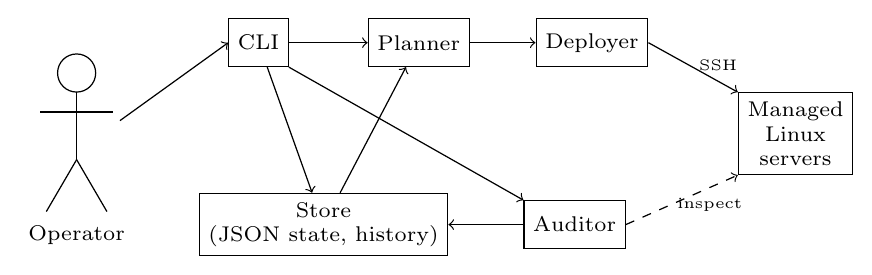
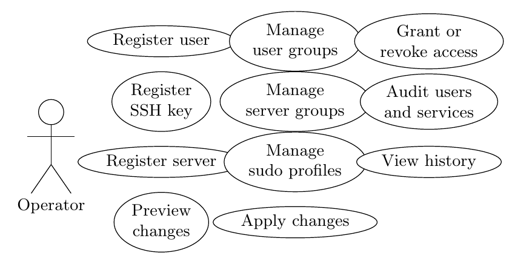

# AdminForge: Declarative Privileged-Identity Management for Linux Server Fleets

This repository is the artifact of the paper *"AdminForge: Declarative Privileged-Identity Management for Linux Server Fleets"* (SBSeg 2026, Salão de Ferramentas, Código Aberto). AdminForge is an open-source command-line tool that manages users, SSH keys, and access permissions on Linux server fleets: the operator declares the desired access state, previews the resulting changes, and applies them over SSH, with every operation appended to a local, hash-chained operation history and no resident service installed on managed hosts. The paper reports an exploratory usability evaluation (five experienced Linux administrators completed the full nine-task workflow without prior training, median ratings 6/7) and a performance evaluation on a local Docker fleet.

<p align="center"></p>
<p align="center"></p>

# README structure

1. [Selos Considerados](#selos-considerados)
2. [Informações básicas](#informações-básicas)
3. [Dependências](#dependências)
4. [Preocupações com segurança](#preocupações-com-segurança)
5. [Instalação](#instalação)
6. [Teste mínimo](#teste-mínimo)
7. [Experimentos](#experimentos) (Reivindicações #1 a #3)
8. [LICENSE](#license)

Repository layout: `adminforge/` (the tool: one package per architecture module: `cli/`, `store/`, `planner/`, `deployer/`, `auditor/`, plus `domain.py`); `tests/` (offline unit tests); `infra/perf/` (performance-experiment harness and results); `docs/` (full tool documentation in `docs/TOOL.md`, usage guides, conceptual model, and the usability-study replication package under `docs/usability-study/`); `paper_data/AVAILABILITY.md` (index of every paper artefact).

# Considered Seals

The considered seals are: **Available (SeloD), Functional (SeloF), Sustainable (SeloS), and Reproducible (SeloR)**.

# Basic information

| Component | Requirement |
|---|---|
| OS | Linux x86-64 |
| Runtime | Python ≥ 3.11 (standard library only; no third-party packages at run time) |
| System packages | `git`, `docker` (Engine ≥ 24, for the experiment fleet), `ssh`, `ssh-keygen` |
| Hardware | any 4-core / 8 GB RAM machine; ~2 GB free disk |

Paper experiments ran on: AMD Ryzen 5 8600G (6 cores), 30 GB RAM, Linux kernel 6.17, Python 3.12, Docker Engine 29.4.

# Dependencies

The tool has **zero third-party Python dependencies at run time** (`dependencies = []` in `pyproject.toml`; only the standard library is imported). Optional extras: `completion` (argcomplete, shell autocompletion) and `dev` (pytest ≥ 8.0, for the test suite). The experiment fleet uses the `debian:12-slim` Docker image with `openssh-server` and `sudo` (built locally by the claim scripts; ~150 MB download on first run). The Ansible baseline of Claim #2 runs inside a container built by the harness; no Ansible is installed on the host.

# Security concerns

Everything runs locally: no telemetry, no external API calls, no credentials leave the machine. The claim scripts create a local Docker fleet whose SSH ports bind to `127.0.0.1` only (never exposed to the network); containers, networks, and temporary state directories are removed at the end of each script. The tool itself only ever distributes SSH *public* keys to the containers it manages.

# Installation

```bash
git clone https://github.com/BagualOps/adminforge-sbseg2026
cd adminforge-sbseg2026
python3 -m venv .venv && source .venv/bin/activate
pip install -e ".[dev]"        # < 1 min; installs the tool + pytest only
```

After this, the `af` command (alias of `adminforge`) is available.

# Minimal test

Offline unit tests, then one real registration observed end to end with the hash chain verified (~30 s, no Docker needed):

```bash
python3 -m pytest tests/ -q     # expected: "112 passed, 1 skipped" (~3 s, no network)
export ADMINFORGE_STATE=$(mktemp -d)
ssh-keygen -q -t ed25519 -N "" -f /tmp/alice_key
af user add --username alice --name "Alice Souza" --email alice@example.com --key-file /tmp/alice_key.pub
af history verify
```

Expected final lines:

```
  OK  user add alice  (OP-0001)
  OK  user key add alice  (OP-0002)
  OK  chain intact (last hash: <64 hex digits>)
```

# Experiments

The paper makes three performance claims, each reproduced by one script that builds a local Docker fleet, runs the measurement, prints a result box ending in `OK`, and cleans up after itself. Wall-clock times below are for the reference machine; they scale with CPU speed, and the assertions are hardware-independent (ratios and structural counts, not absolute seconds).

## Claim #1: Apply time scales linearly with fleet size

- **Description:** cold `apply` costs a constant time per host (no super-linear growth), and a no-change `apply` is near-instant regardless of fleet size. Runs the reduced ladder (N=1 and N=5 hosts, 1 repetition each) and asserts that the per-host cold-apply times at N=1 and N=5 differ by less than 40%, and that the no-op apply stays under 2 s.
- **Execution:** `./run_claim1.sh`
- **Expected time:** ~6 min (first run: +2 min image build)
- **Expected resources:** ~2 GB RAM, ~1 GB disk, 6 containers
- **Expected result:** a box reporting per-host times and ending in `→  OK`

## Claim #2: Cold apply within the same order of magnitude as an Ansible playbook on the identical fleet

- **Description:** the same fleet state applied by AdminForge and by the equivalent Ansible playbook (identical inputs, N=5 hosts); asserts both complete and reports the ratio. The paper claims comparable order of magnitude, not victory: AdminForge is not optimized for speed (administrative operations are sporadic; the design priorities are security, ease of use, and zero external dependencies).
- **Execution:** `./run_claim2.sh`
- **Expected time:** ~8 min
- **Expected resources:** ~2 GB RAM, ~1.5 GB disk, 6 containers
- **Expected result:** a box with both wall-clock times and the ratio, ending in `→  OK`

## Claim #3: Executed code surface under 4,600 lines with zero third-party runtime imports

- **Description:** recounts the tool's own source lines, walks every `import` reachable from the CLI entry point, and asserts: own source < 4,600 lines and no module outside the Python standard library in the base install. Deterministic; no Docker.
- **Execution:** `./run_claim3.sh`
- **Expected time:** < 1 min
- **Expected resources:** negligible
- **Expected result (deterministic):**

```
══════════════════════════════════════════════════════════════
  Claim #3: attack surface of the base install
══════════════════════════════════════════════════════════════
  Own source (adminforge/**.py) : 4567 lines   (claim: < 4,600)
  Third-party runtime imports   : 0   (claim: 0)

  Expected: lines < 4,600 and 0 third-party imports  →  OK
══════════════════════════════════════════════════════════════
```

The full measurement harness behind the paper's performance section (5-repetition ladders up to N=50 hosts, the Ansible comparison, and the attack-surface audit) lives in `infra/perf/`, with the raw per-repetition results committed under `infra/perf/results/`.

# LICENSE

[GNU AGPL-3.0](LICENSE).
