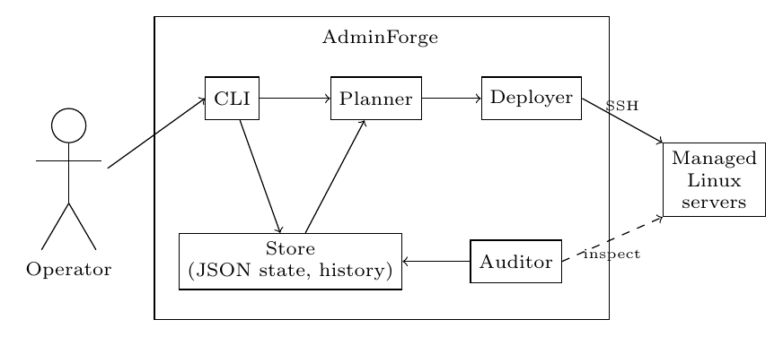
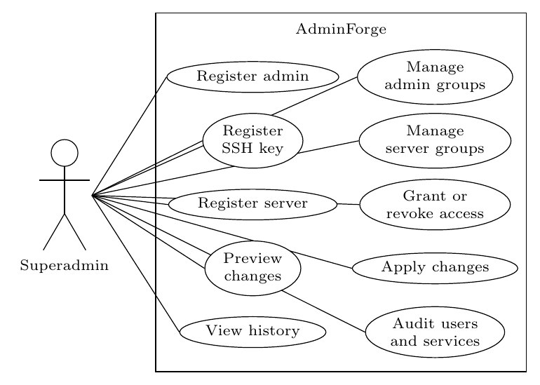

# AdminForge: Declarative Privileged-Identity Management for Linux Server Fleets

> ❄️ **Frozen version.** This repository holds the SBSeg 2026 paper version of AdminForge and
> stays frozen for reproducibility. Active development continues at
> [BagualOps/adminforge](https://github.com/BagualOps/adminforge).

This repository is the artifact of the paper *"AdminForge: Declarative Privileged-Identity Management for Linux Server Fleets"* (SBSeg 2026, Salão de Ferramentas, Código Aberto). AdminForge is an open-source command-line tool that manages users, SSH keys, and access permissions on Linux server fleets: the operator declares the desired access state, previews the resulting changes, and applies them over SSH, with every operation appended to a local, hash-chained operation history and no resident service installed on managed hosts. The paper reports an exploratory usability evaluation (five experienced Linux administrators completed the full nine-task workflow without prior training, median ratings 6/7) and a performance evaluation on a local Docker fleet. A [demonstration video](https://youtu.be/6rs2qtIuMvs) explains installation and features.

<p align="center"></p>
<p align="center"></p>

> **For the artifact evaluation, this README is the only file you need to read.** The other
> Markdown files in the repository are complementary: [`docs/TOOL.md`](docs/TOOL.md) is the
> command reference and [`docs/usability-study/`](docs/usability-study/) is the study package.

# README structure

| Section | Description |
|---|---|
| [Considered seals](#considered-seals) | The four seals and why each one holds |
| [Basic information](#basic-information) | OS, runtime, hardware and measured times |
| [Dependencies](#dependencies) | What is required, and what is deliberately not |
| [Security concerns](#security-concerns) | What runs where, network use, credentials |
| [Installation](#installation) | Clone; nothing is installed |
| [Minimal test](#minimal-test) | One command, one real registration, chain verified |
| [Experiments](#experiments) | Claims #1 to #3, one command each |
| [Cleaning up](#cleaning-up) | One command removes what a run created |
| [How to cite](#how-to-cite) | Paper reference, BibTeX and `CITATION.cff` |
| [LICENSE](#license) | AGPL-3.0-or-later |

The repository is organized as follows:

```
adminforge/          the tool, one package per architecture module
  cli/               command-line entry points
  store/             declared state and the append-only history
  planner/           diffs the declared state against what the hosts have
  deployer/          applies a plan over SSH
  auditor/           reads back what is installed and reports drift
  domain.py          the entities: users, keys, servers, groups, grants
tests/               offline unit tests (120 passed, 2 skipped)
infra/perf/          the Claim #1 harness: fleet builder, Ansible controller, timings
paper_data/          the study responses, the questionnaire and AVAILABILITY.md
docs/                TOOL.md, the conceptual model, and the usability-study package
run_claim1.sh        Claim #1: per-host cost and the no-change apply against Ansible
run_claim2.sh        Claim #2: the usability-study statistics
run_claim3.sh        Claim #3: executed code surface and third-party imports
minimal_test.sh      the minimal test
cleanup.sh           removes everything a run created
```

# Considered seals

- **Available (SeloD):** this repository is public under AGPL-3.0-or-later, and every input
  the paper uses is committed here: the study responses, the questionnaire, the performance
  harness and the reference results. Nothing is fetched from a private location.
- **Functional (SeloF):** `./minimal_test.sh` registers a user, adds an SSH key and verifies
  the hash chain over both operations in a fraction of a second, with no Docker and no network.
- **Sustainable (SeloS):** the tool is 3,993 lines of Python with **zero third-party runtime
  imports**, split one package per architecture module (`cli`, `store`, `planner`,
  `deployer`, `auditor`) over a single `domain.py`, so each concern is replaceable on its
  own. 120 unit tests run offline in about four seconds; [`docs/TOOL.md`](docs/TOOL.md) documents every
  command; and Claim #3 measures both properties rather than asserting them. Because there
  are no dependencies, the artifact cannot rot through one: any Python 3.11 or newer runs it.
- **Reproducible (SeloR):** Claims #2 and #3 are deterministic and offline, and reproduce the
  paper's numbers exactly. Claim #1 measures live on the reviewer's machine and gates on the
  quantities that survive a change of hardware, per-host flatness and the ratio against
  Ansible, never on absolute seconds.

# Basic information

| Component | Requirement |
|---|---|
| OS | Linux x86-64 |
| Runtime | Python ≥ 3.11 (standard library only; no third-party packages at run time) |
| System packages | `git`, `docker` (Engine ≥ 24, for the experiment fleet), `ssh`, `ssh-keygen` |
| Hardware | any 4-core / 8 GB RAM machine; ~2 GB free disk |

Paper experiments ran on: AMD Ryzen 5 8600G (6 cores), 32 GB RAM, Linux kernel 6.17, Python 3.12, Docker Engine 29.4.

### Reproduction time (and why it depends on your hardware)

The claim scripts **measure live on your machine**, so wall-clock times scale with CPU speed, disk, and (first run only) how long Docker takes to build the fleet images and pull base images. The table below was measured on an AMD Ryzen 7 9700X (16 threads, 59 GB RAM, Ubuntu 26.04), which is not the machine the paper used. **On a slower CPU, a laptop, or a cold Docker cache, expect noticeably longer, especially for Claim #1.** What is *not* hardware-dependent, and is what each claim actually asserts, is the printed **`→ OK`** verdict and the ratios/counts behind it (per-host flatness, the no-op speedup over Ansible, the SLOC and import counts, the recomputed study statistics).

| Step | Command | Measured (Ryzen 7 9700X, warm Docker cache) |
|---|---|---|
| Install | none | 0 s |
| Minimal test | `./minimal_test.sh` | 0.13 s |
| **Claim #1** | `./run_claim1.sh` | **3m23s** (a live N=1/5 ladder and an N=10 Ansible run; the first run also builds the images) |
| **Claim #2** | `./run_claim2.sh` | **0.02 s** |
| **Claim #3** | `./run_claim3.sh` | **0.05 s** |

> These are one machine's numbers; yours will differ. Only Claim #1 uses Docker; the first run also builds the fleet and Ansible-controller images (add build time on a cold cache). If you reproduce on other hardware, please open a PR/issue adding a row here.

# Dependencies

The tool has **zero third-party Python dependencies at run time** (`dependencies = []` in `pyproject.toml`; only the standard library is imported). Optional extras: `completion` (argcomplete, shell autocompletion) and `dev` (pytest >= 8.0, for the test suite). Claim #2 reads the study responses from the committed CSV with the standard library, so it needs nothing installed either. Host tools needed are only **git, docker, python3, ssh, and ssh-keygen**, plus a Docker daemon running and usable by your user without `sudo`. `run_claim1.sh` checks all of them before building anything and prints the install command for the package manager it finds. Note that `ssh` and `ssh-keygen` come from one package, whose name is not the tool name:

```bash
sudo apt-get update && sudo apt-get install -y git docker.io python3 openssh-client   # Debian, Ubuntu
sudo dnf install -y git docker python3 openssh-clients                                # Fedora, RHEL
sudo pacman -Sy --needed git docker python openssh                                    # Arch
sudo zypper install -y git docker python3 openssh-clients                             # openSUSE
sudo usermod -aG docker "$USER" && newgrp docker                                      # use docker without sudo
```

Claims #2 and #3 need only git and python3. The experiment fleet uses the `debian:12-slim` Docker image with `openssh-server` and `sudo` (built locally by the claim scripts). **Ansible is never installed on the host:** Claim #1 builds an Ansible control-node container (`python:3.12-slim` + `ansible-core` + `openssh-client`) and runs the playbook from it, on the fleet's Docker network. Claim #1's first run therefore needs **internet** to pull the base images and install `ansible-core` into the controller image (Claims #2 and #3 are fully offline).

# Security concerns

Everything runs locally: no telemetry, no external API calls, no credentials leave the machine. The claim scripts create a local Docker fleet whose SSH ports bind to `127.0.0.1` only (never exposed to the network); containers, networks, and temporary state directories are removed at the end of each script. The tool itself only ever distributes SSH *public* keys to the containers it manages.

# Installation

None. AdminForge imports nothing outside the Python standard library, so it runs from the
clone with the system Python:

```bash
git clone https://github.com/BagualOps/adminforge-sbseg2026
cd adminforge-sbseg2026
```

Every command below is `python3 -m adminforge.cli.main` run from this directory, and the
claim scripts call it that way themselves. There is nothing to install and nothing to
activate. On a current Debian or Ubuntu, installing into the system Python is refused by
PEP 668; this artifact never needs it.

The one optional extra is `pytest`, and only to run the unit suite. If your system does not
already provide it (`sudo apt update && sudo apt install -y python3-pytest` on Debian and Ubuntu,
`sudo dnf install -y python3-pytest` on Fedora), the suite can be skipped: it exercises the same code the minimal
test and the three claims already run.

# Minimal test

One command, well under a second, no Docker and no network. It registers a user, adds an SSH
key and verifies the hash chain over the two operations:

```bash
./minimal_test.sh
```

Expected final lines:

```
  OK  user add alice  (OP-0001)
  OK  user key add alice  (OP-0002)
  OK  chain intact (last hash: <64 hex digits>)
MINIMAL TEST: PASSED
```

With `pytest` installed, `python3 -m pytest tests/ -q` runs the offline suite as well:
`120 passed, 2 skipped` in about 4 seconds.

# Experiments

The paper makes three claims. Each is one command and prints a result box ending in `→ OK` so the evaluator knows it came out right. Claim #1 needs Docker (the rest do not). Wall-clock times scale with CPU speed; the assertions are hardware-independent (ratios, counts, recomputed statistics).

## Claim #1: Linear per-host cost, and an instant "is anything pending?" against Ansible

**What the paper asserts.** Cold `apply` costs a roughly constant time per host (so it scales linearly with the fleet), and a no-change `apply` is answered from local state without touching any host, far faster than an Ansible re-run that must reconnect to every host. The script measures both **live on your machine**, into a throwaway directory (it never reuses the committed reference numbers):

- **(a) Scalability:** a reduced ladder (N=1 and N=5, 1 repetition) via [`infra/perf/run_e1.py`](infra/perf/run_e1.py); checks the per-host cold-apply cost is flat (< 40% difference) and the no-op stays under 2 s.
- **(b) Comparison with Ansible:** N=10 via [`infra/perf/run_e2.py`](infra/perf/run_e2.py); the Ansible control node runs as a container (no Ansible on the host), applies the equivalent playbook to the same fleet, and the script checks AdminForge's no-change apply is at least 5x faster than Ansible's equivalent re-run.

**Execution:** one command (needs Docker, and internet on the first run).

```bash
./run_claim1.sh
```

- **Flags:** `--dry-run` checks the comparison logic **without Docker**. It feeds the stored
  reference measurements in [`infra/perf/results/raw/`](infra/perf/results/raw/) to the same
  assertion block the live run uses, so the thresholds and the arithmetic are exercised end
  to end and print the same verdict block, with every number labelled *stored reference
  results, NOT measured here*. It runs in under a second and needs nothing but `python3`.
  It shows what the claim asserts; it does not confirm the claim on your machine, which is
  what the plain run is for.
- **Expected time:** 3m23s measured with the images already built; the first run adds the
  Docker build of the fleet and Ansible-controller images. With `--dry-run`, instant.
- **Expected resources:** ~410 MB of Docker images (measured: the fleet image, the Ansible
  fleet image and the controller), under 1 GB of RAM, and 11 local containers at the N=10
  step. Docker required; no GPU.

**Expected result** (`XXX` marks every value that is yours, not ours: **your absolute seconds will differ**, and what the claim asserts is the final `-> OK` and the hardware-independent quantities: per-host flatness, the tens-to-hundreds-x no-op speedup over Ansible, and 78 lines of YAML vs 29 commands):

```
======================================================================
  Claim #1: linear per-host cost, and instant "is anything pending?"
======================================================================
  (a) Scalability (base image, measured live)
      N=1  cold apply :  XXX.X s     no-op apply : X.XX s
      N=5  cold apply :  XXX.X s     no-op apply : X.XX s
      Per-host cold   : N=1 XX.X s/host   N=5 XX.X s/host   (diff X.X%)

  (b) Comparison with Ansible at N=10 (python3 image, measured live)
      First apply     : AdminForge  XXX.X s (parallel)   Ansible  XXX.X s
      No-op re-run    : AdminForge  X.XX s (local)      Ansible  XXX.X s   (XXXx faster)
      Write effort    : AdminForge 29 commands    Ansible 78 lines of YAML

  Assertions (hardware-independent):
    per-host cold flat (<40% diff)                         -> OK
    no-op apply < 2 s                                      -> OK
    AdminForge no-op >= 5x faster than Ansible re-run      -> OK
  Overall  ->  OK
======================================================================
```

**Measured on two machines**, which is the point: the absolute seconds nearly double while
what the claim asserts does not move.

| Machine | Per-host cold apply | Flatness | No-op apply | vs Ansible re-run |
|---|---|---|---|---|
| Ryzen 7 9700X, 16 threads | 11.5 / 11.3 s | 1.7% | 0.08 s | 256x |
| A second, slower host | 20.9 / 20.5 s | 2.0% | 0.15 s | 155x |

The full 5-repetition ladder up to N=50, all Ansible configurations, and the attack-surface check live in [`infra/perf/`](infra/perf/), with the paper's committed per-repetition results under [`infra/perf/results/`](infra/perf/results/).

## Claim #2: Usability-study statistics recomputed from the anonymized response data

**What the paper asserts.** All 39 numbers reported in the paper's per-task table and construct-aggregate table (medians, means, IQRs, standard deviations, top-box percentages). The evaluator recomputes them from the raw data without repeating the study; the annotation was performed by the paper authors and is not expected to be reproduced.

**Execution:** one command.

```bash
./run_claim2.sh
```

- **Flags:** none.
- **Expected time:** 0.02 s measured. It reads one committed CSV and recomputes.
- **Expected resources:** ~13 MB peak RAM, no disk written. No Docker, no network, nothing
  installed.

**Expected result:**

```text
================================================================================
  Claim #2 — Usability study: paper statistics recomputed from the
  anonymized response data  (5 participants, no re-run of the study)
================================================================================
  Task                               Confidence               Ease
  ──────────────────────────  ─────────────────  ─────────────────
  Register user and SSH key   7 (6.6)           6 (6.0)
  Register servers            7 (6.6)           6 (6.2)
  Organize groups             7 (6.4)           7 (6.6)
  Grant access                7 (6.6)           6 (6.4)
  Apply changes               6 (5.8)           6 (6.0)
  Configure restricted sudo   7 (6.2)           5 (4.6)
  Revoke access               7 (6.4)           6 (5.8)
  Run audit                   5 (5.0)           6 (5.0)
  Inspect history             7 (6.6)           6 (6.4)

  Construct                         Med       IQR   Top%    Mean     SD
  Perceived usefulness (PU)           6   3.8–7.0     60%   5.40   1.76
  Perceived ease of use (PEOU)        6   4.5–7.0     70%   5.55   1.61
  Intention to use (ITU)              6   4.5–7.0     73%   5.47   1.77
  Security and confidence (SC)        6   3.0–7.0     65%   5.30   1.81

  All 39 study numbers match the paper  →  OK
================================================================================
```

**Reference data in the repository:** anonymized responses [`paper_data/study-responses.csv`](paper_data/study-responses.csv) (and the original [`study-responses.xlsx`](paper_data/study-responses.xlsx)) (timestamps removed, no names, no emails) and the questionnaire instrument [`paper_data/study-questionnaire.pdf`](paper_data/study-questionnaire.pdf).

## Claim #3: Executed code surface under 4,000 lines with zero third-party runtime imports

**What the paper asserts.** The tool's own source is under 4,000 lines of code (statements only: blank lines, comments and docstrings excluded) and the base install imports nothing beyond the Python standard library at run time.

**Execution:** one command.

```bash
./run_claim3.sh
```

- **Flags:** none.
- **Expected time:** 0.05 s measured.
- **Expected resources:** ~20 MB peak RAM. No Docker, no network.

**Expected result (deterministic; the numbers below are exact, not hardware-dependent):**

```
══════════════════════════════════════════════════════════════
  Claim #3: attack surface of the base install
══════════════════════════════════════════════════════════════
  Own code (adminforge/**.py)   : 3973 lines of code (claim: < 4,000)
  Third-party runtime imports   : 0   (claim: 0)

  Expected: code < 4,000 and 0 third-party imports  →  OK
══════════════════════════════════════════════════════════════
```

The line count is statements only — blank lines, `#` comments and docstrings are documentation rather than executed code, and [`infra/perf/sloc.py`](infra/perf/sloc.py) drops all three before counting; the import check loads every runtime module and asserts none resolves to `site-packages`. The full measurement harness behind the paper's performance section (5-repetition ladders up to N=50 hosts, the Ansible comparison, and the attack-surface audit) lives in [`infra/perf/`](infra/perf/). Claim #2's reference data is in [`paper_data/`](paper_data/).

## Cleaning up

One command removes everything a run created: the environment, the caches, the state
directory and any container left by Claim #1. It never touches anything tracked by git.

```bash
./cleanup.sh
```

Pass `--dry-run` to list what would go without removing it.

# How to cite

If you use this artifact, please cite the paper:

> Ribeiro, R. Q., Kapelinski, C. and Kreutz, D. (2026). AdminForge: Declarative
> Privileged-Identity Management for Linux Server Fleets. In *Anais do XXVI Simpósio
> Brasileiro de Segurança da Informação e de Sistemas Computacionais (SBSeg 2026)*, Salão
> de Ferramentas. Sociedade Brasileira de Computação (SBC).

```bibtex
@inproceedings{ribeiro2026adminforge,
  title     = {{AdminForge}: Declarative Privileged-Identity Management for {Linux} Server Fleets},
  author    = {Ribeiro, Rui de Quadros and Kapelinski, Cristhian and Kreutz, Diego},
  booktitle = {Anais do XXVI Simp\'osio Brasileiro de Seguran\c{c}a da Informa\c{c}\~ao e de Sistemas Computacionais (SBSeg 2026), Sal\~ao de Ferramentas},
  year      = {2026},
  publisher = {Sociedade Brasileira de Computa\c{c}\~ao (SBC)},
}
```

[`CITATION.cff`](CITATION.cff) carries the same reference in machine-readable form.

# LICENSE

[GNU AGPL-3.0](LICENSE), or any later version.

**What that means for use inside a company.** Two clauses decide this, and both are worth
reading in [LICENSE](LICENSE) rather than taken from here. Section 0 defines *propagate* as
anything that would make you liable for infringement "except executing it on a computer or
modifying a private copy", and defines *convey* as propagation "that enables other parties
to make or receive copies", adding that "mere interaction with a user through a computer
network, with no transfer of a copy, is not conveying". Running AdminForge on your own
fleet, and modifying it for your own use, therefore fall outside both. Section 13 is the
clause the AGPL adds over the GPL: a modified version "must prominently offer all users
interacting with it remotely through a computer network (if your version supports such
interaction)" access to the corresponding source. Note *all users*, with no carve-out for
people inside your organization. What keeps that clause out of scope here is the
parenthesis: AdminForge is a CLI that acts on hosts over SSH and supports no remote
interaction of its own, so Section 13 is reached only by someone who wraps it in a network
service. Conveying it outside your organization, modified or not, does carry the usual
obligation to offer the corresponding source under the same licence. This is orientation,
not legal advice; the licence text governs, and redistribution is worth a legal opinion.
